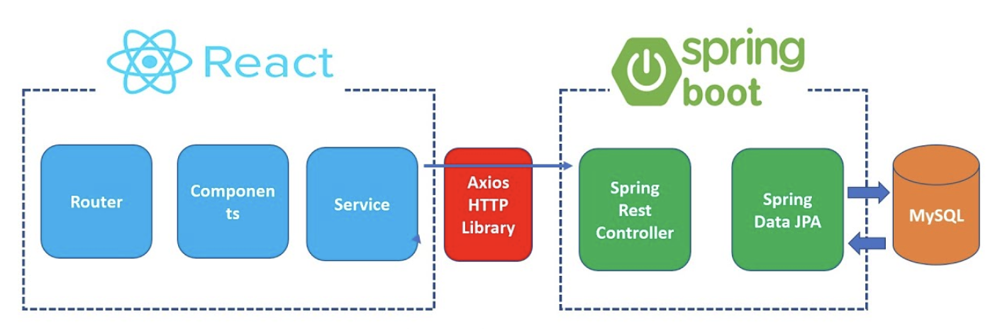

# Booksphillic
---

## 아키텍처

## 프로젝트 목표
---
- 동네 서점과 소비자를 연결하여 서점 소개, 책 추천, 이벤트 소개까지 한번에 제공하는 서비스

## 사용한 기술 & 개발 환경
---
- JAVA 11
- SpringBoot 2.6.6
- Gradle
- MySQL
- Spring Data JPA

## 프로젝트 룰
---

### 커밋 메시지
> 출처: [좋은 git 커밋 메시지를 작성하기 위한 7가지 약속](https://meetup.toast.com/posts/106)

1. 제목과 본문은 한 줄 띄워 분리
2. 제목은 50자 이내로
3. 제목 첫글자는 대문자로
4. 제목 끝에 `.` 금지
5. 제목은 명령문으로 사용하며 과겨형은 사용하지 않음
6. 본문은 영문 기준 72자마다 줄 바꿈
7. 본문은 `어떻게` 보다 `무엇을`, `왜`에 맞춰 작성

### 커밋 메시지 제목 작성 가이드
> 출처: [Git Commit Message StyleGuide](https://github.com/slashsbin/styleguide-git-commit-message#message-subjectfirst-line)

태그 이름 | 설명
---|---
CHORE|코드 수정, 내부 파일 수정
FEAT|새로운 기능 구현
HOTFIX|Issue나, QA에서 급한 버그 수정에 사용
FIX|버그, 오류 해결
DOCS|README나 WIKI 등의 문서 개정
REFACTOR|전면 수정이 있을 때 사용
